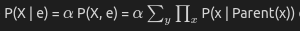

## Step 1:
Understand the Problem statement provided, understand the relations between different variables.
## Step 2:
Please observe the constructed Bayesian Network which is provided in the workspace.
## Step 3:
You could rearrange the nodes if the edge connections are not clear.
## Step 4:
Now click on the nodes to find the CPT tables of the node.
## Step 5:
Using the formula mentioned in theory i.e

  

compute the probabilites. Note that the conditional probabilities are availiable in CPT table.
## Step 6:
If you are struggling please refer to the hints section where one particular iteration of the algorithm is solved.
## Step 7:
Check your answers by clicking check button.
