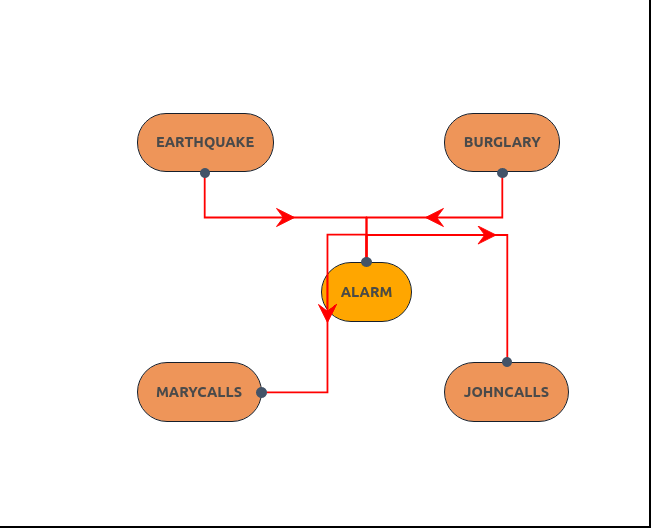

For any efficient construction, if we could not get any useful inference then it is useless. One of the basic inference is to calculate the posterior probability of query variables given some observed event (when we say observed event we mean is that some of the variables are set to some values). For the sake of understanding lets consider one variable in query variable. There will be some evidence provided let it be denoted by E. And there will be some more varilables other than evidence and query variable lets call them hidden varilables denoted by Y. A typical query asks for the posterior
probability distribution P(X | e).

  

Let us understand why such an equation is valid. Firstly using bayes formula we know that P(X|e) = P(X, e)/P(e).

But P(e) is a constant so it can be pulled out and replaced with a constant $\alpha$. Now we can represent P(X, e) using rest of the hidden variables. Where hidden varilables take all possible combinations. It is like saying P(A) = P(A and (B=T or B=F)), we are just including something which will not impact the final result. This is very useful because we know some useful results for joint probabilities when the network is already constructed. 

Lets take the example given in the textbook.

You have a new burglar alarm installed at home. It is fairly reliable at detecting a burglary, but also responds on occasion to minor earthquakes. (This example is due to Judea Pearl, a resident of Los Angeles—hence the acute interest in earthquakes.) You also have two neighbors, John and Mary, who have promised to call you at work when they hear the alarm. John nearly always calls when he hears the alarm, but sometimes confuses the telephone ringing with the alarm and calls then, too. Mary, on the other hand, likes rather loud music and often misses the alarm altogether. Given the evidence of who has or has not called, we would like to estimate the probability of a burglary. Lets take a valid constructed Bayesian network for it. [Trouble in constructing Bayesian Network? Please refer to construction of Bayesian Netowrk experiment].
  

Now say we would like to find the probability of Burglary if it is said that John, Mary both called. In mathematical equation we can represent it:

P(Burglary | JohnCalls = true, MaryCalls = true)

In this case the query variable is Burglary. And Johncalls, Marycalls are evidence variables. And hidden variables are earthquake and alarm. We could write the above equation as:

In this equation we have used shorthand notations for varilables for the ease of explaining things.
Lets consider the case for Burglary = T, and we can rewrite the above equation as:

  

This is because we know that we cold write total probability as product of individuation coditional probabilities of the varilables, but they are conditionally only dependent on their parents in the bayesian graph.

In our constructed graph, notice that parents of Alarm variable are Burglary and Earthquake. So when we are calculating the total probability it is enough for us to include P(Alarm | Burglary, Earthquake). Similary we do for rest of the varilables and we multiply them. 

Notice that although this algorithm is complete. The compexity can be as high as n * 2**n. Which is too much for larger values of n. We can reduce the complexity a little bit by rearranging the terms in the formula. We might be reevaluating things which need not be. So one solution would be to store the values which are computed in a separate place. There are more advanced algorithms but out of scope for the purpose of this project, please refer to textbook section 14.4 for more details.

Note: The following content is read from book mentioned in resources mentioned. 